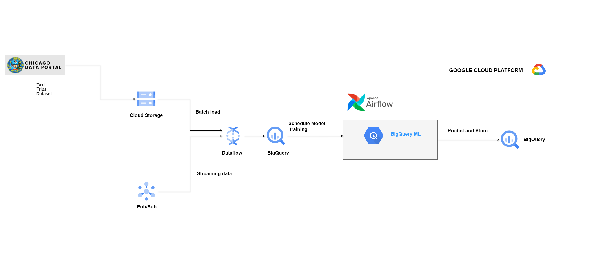

# Taxi Model Training with Airflow and BigQuery ML

This repository contains an Apache Airflow DAG for training machine learning models to predict taxi fare and trip duration using Google BigQuery ML. 

The Chicago taxi dataset is available in BigQuery public datasets(bigquery-public-data.chicago_taxi_trips.taxi_trips). However, if you want to learn about batch and stream loading using Dataflow, the following scripts are provided in the repository:

**1. batch_load_taxi_trips.py**

**2. stream_load_taxi_trips.py**

## Overview

We use Apache Airflow to automate the monthly training process for two linear regression models:
1. **Taxi Fare Prediction Model**: Trains a model to predict the fare of a taxi trip.
2. **Taxi Trip Duration Prediction Model**: Trains a model to predict the duration of a taxi trip.

The models are trained using the Chicago Taxi Trips dataset available in BigQuery public datasets. The DAG orchestrates the training workflow, ensuring the models are updated monthly with the latest available data.
